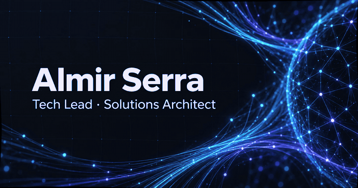
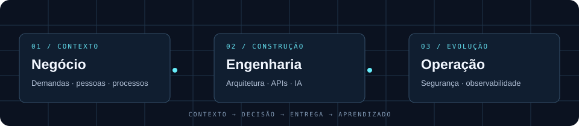

  <b>ARQUITETURA · IA APLICADA · INTEGRAÇÕES · DEVOPS</b>

  <a href="https://www.linkedin.com/in/almir-serra-21a744179/"><b>LinkedIn ↗</b></a>
  &nbsp; / &nbsp;
  <a href="https://github.com/AlmirSerra/portfolio"><b>Portfólio ↗</b></a>
  &nbsp; / &nbsp;
  <a href="mailto:almirfserra@gmail.com"><b>Contato ↗</b></a>

---

### 01 / Da complexidade à solução

Sou **Almir Serra**, Tech Lead e Solutions Architect, com atuação em projetos corporativos na Unicampo. Conecto negócio, desenvolvimento e infraestrutura para projetar, integrar, implantar e sustentar soluções tecnológicas.

Meu trabalho passa por **modernização de sistemas legados, IA corporativa, integração de ERPs, automação e governança tecnológica**. Da decisão de arquitetura à operação, o foco é construir uma base que permita ao negócio evoluir.

### 02 / Sistemas que ajudei a colocar em movimento

<table>
<tr>
<td width="50%" valign="top">

**◈ UniGPT · Inteligência corporativa**

Estruturação de uma plataforma de IA com acesso centralizado a diferentes modelos, permissões e controle de consumo.

`IA aplicada` `Governança` `Integração`

</td>
<td width="50%" valign="top">

**⇄ ERP legado → novo ERP**

Mapeamento de dados, APIs, regras de negócio e automação de processos críticos para apoiar a transição entre plataformas.

`APIs` `Dados` `Continuidade`

</td>
</tr>
<tr>
<td width="50%" valign="top">

**⌁ Monitor + Uptime Kuma**

Observabilidade de sessões e erros, disponibilidade de serviços, endpoints e certificados para apoiar diagnóstico e atuação preventiva.

`Observabilidade` `Disponibilidade`

</td>
<td width="50%" valign="top">

**◇ Passbolt · Gestão de acessos**

Implantação de um cofre corporativo para centralizar credenciais técnicas e fortalecer as práticas de compartilhamento de acessos.

`Segurança` `Credenciais` `Governança`

</td>
</tr>
<tr>
<td width="50%" valign="top">

**▤ BookCampo · Conhecimento**

Estruturação de documentação colaborativa, procedimentos e runbooks para tornar o conhecimento técnico acessível às equipes.

`Documentação` `Runbooks` `Colaboração`

</td>
<td width="50%" valign="top">

**⎈ Infraestrutura & plataformas**

Administração e evolução de ambientes, containers, bancos de dados e padrões de desenvolvimento, deploy e sustentação.

`Docker` `Linux` `DevOps` `Bancos de dados`

</td>
</tr>
</table>

<b>↳ Outras frentes de entrega</b>

- E-mails transacionais, notificações e comunicações automatizadas integradas a processos corporativos.
- Comunicação em massa e campanhas segmentadas para relacionamento com cooperados.
- Otimização de processos de assinatura eletrônica.
- Automação de rotinas operacionais e integrações com serviços externos.
- Definição de padrões técnicos e disseminação de conhecimento.

Os projetos corporativos são apresentados como experiências de implantação, integração e evolução. Seus códigos e dados internos não estão publicados neste perfil.

### 03 / Ferramentas a serviço da arquitetura

| Camada | Tecnologias e práticas |
| :--- | :--- |
| **Aplicações** | PHP · Laravel · JavaScript · Vue.js |
| **Integração** | APIs REST · Webhooks · Automação · Regras de negócio |
| **Dados** | PostgreSQL · Oracle · MariaDB · SQL |
| **Plataforma** | Linux · Docker · Apache · Nginx · IIS · Payara |
| **Entrega & operação** | Git · CI/CD · DEV/HMG/PROD · Observabilidade · Documentação |
| **Inteligência** | IA generativa aplicada · Integração de modelos · Governança de uso |

<b>↳ Minha base em desenvolvimento e e-commerce</b>

Minha trajetória também inclui jQuery, Bootstrap, WordPress/WooCommerce, OpenCart, PrestaShop, Magento e desenvolvimento de add-ons para WHMCS. Essa experiência compõe minha visão sobre integrações, aplicações e necessidades operacionais.

---

  <b>Visão sistêmica. Profundidade técnica. Execução responsável.</b> 
  Tecnologia conectada às necessidades reais do negócio.

  <a href="https://www.linkedin.com/in/almir-serra-21a744179/">Vamos conversar no LinkedIn →</a>

